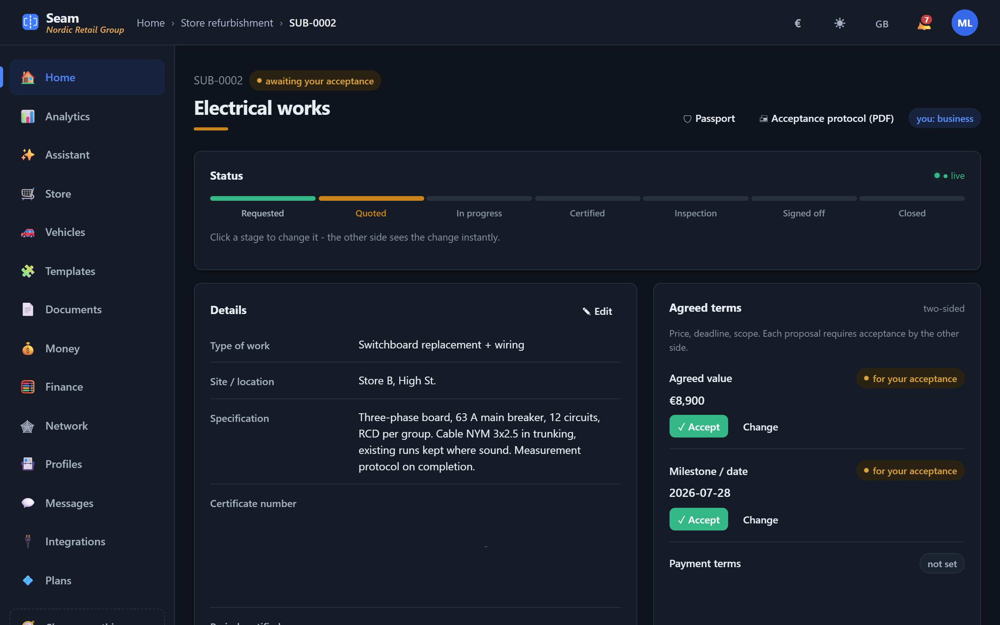
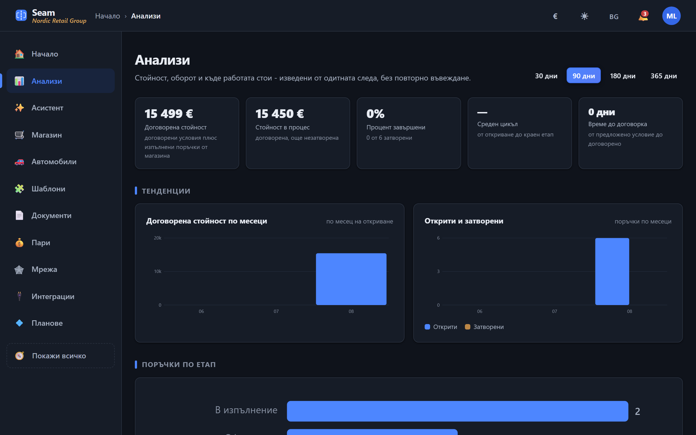
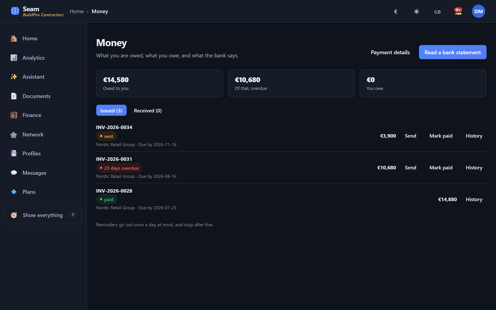

# Seam

**Self-hosted subcontracting platform: one record, both sides, 13 languages.**

When one company subcontracts to another, the job lives in two places. The
buyer has it in their spreadsheet, the contractor has it in theirs, and what
was actually agreed is somewhere in a mail thread. Seam gives the two
companies one shared record instead, with every change dated and attributed.



---

## What it does

- **Orders and statuses.** Each record has its own reference and its own
  pipeline. Both companies watch the same one.
- **Agreed terms.** Price, deadline, scope. Each is proposed by one side and
  accepted by the other, and carries the name and date of who accepted it.
- **Documents and e-signatures.** Country-specific contracts, protocols,
  powers of attorney and GDPR declarations, signed and exported as real PDFs.
  Qualified signatures through the CSC API where a provider is configured.
- **Invoices and payments.** Issued from the record, chased on a schedule,
  matched against a bank statement (CAMT.053 and MT940 are parsed directly).
- **Tax and filing.** VAT, profit tax, filing deadlines and links to the tax
  authority's own e-services, for 15 countries.
- **Profiles and a directory.** Companies publish what they do and what they
  have delivered. Contact details are never handed to a stranger; a request
  goes to the owner instead.
- **Reminders.** Terms due for review, deadlines approaching, invoices overdue.

| | |
|---|---|
|  |  |
| Analytics, including figures the trade add-ons make measurable | Invoices chasing themselves and matched against the bank |

### Trade depth, switched on per company

The base templates stay thin so the first record is easy to open. Depth is
opt-in: **28 packs**, each a real practice with its own fields, agreed terms,
pipeline stage and figures.

- **Construction** — interim works certificates with retention, concealed
  works, health and safety, warranties, plant hours, materials with
  declarations of performance
- **Vehicle import** — customs clearance with MRN, registration, environmental
  tax, transport, inspection, damage assessment, finance
- **E-commerce** — returns, cash on delivery, batches and shelf life,
  marketplace channels, service levels
- **Across all trades** — quality control, confidentiality and GDPR,
  insurance, crew on site, cold chain

Switching a pack off stops offering its fields; it never deletes what was
already recorded under them.

---

## Running it

Python 3.9 or newer.

```sh
pip install -r requirements.txt
python seed.py          # demo companies and records
python app.py
```

Then <http://127.0.0.1:5000>, and sign in as `ops@seam.demo` / `demo1234`.

To see the point of the product, open a second browser as `build@seam.demo`
with the same password: the same record, from the contractor's side.

On Windows, `demo.ps1` does all of the above and can open a public HTTPS
address through a Cloudflare tunnel for showing it to somebody remote.

For a real deployment, see **[DEPLOY.md](DEPLOY.md)** — a one-command install
with automatic HTTPS for a Linux box, or a Dockerfile and `fly.toml`.

## Tests

```sh
python tests/run_tests.py     # 2204 checks against a real server
python tests/audit_web.py     # accessibility, links, page weight, both themes
```

The runner starts its own server on a spare port with its own database, seeds
it, and starts mock providers for SMTP, SMS, S3, CSC signing and OIDC. Nothing
needs configuring and nothing reaches a real service.

These are integration tests on purpose. The bugs in this system have been a
SQL function that does not lowercase Cyrillic, a service worker scope, a CSRF
guard that locked out the people it was meant to admit, and a column that
never existed sitting in a live code path. Unit tests would have missed all
four.

`tests/audit_web.py` drives a real browser and measures contrast against each
element's actual background rather than its declared one.

---

## How it is built

| | |
|---|---|
| Server | Python, Flask, waitress. 28 modules, ~20 000 lines |
| Browser | Vanilla JavaScript, no framework, no build step. ~10 000 lines |
| Storage | SQLite in WAL mode. No database server |
| API | 218 routes |

**Flask and waitress are the only dependencies.** PDF export, e-signatures,
TOTP, AWS request signing, Web Push with VAPID, CAMT.053 and MT940 parsing,
GIF encoding and the Chrome DevTools Protocol driver are all written against
the standard library.

That is deliberate. It means the whole thing can be read and audited, it
deploys anywhere Python runs, and it carries no supply chain that was not
chosen on purpose.

### Layout

```
app.py                  routes, request handling, the bulk of the logic
db.py                   schema (54 tables), migrations
taxes.py                VAT, profit tax, filing calendar and portals, 15 countries
templates_config.py     7 base relationship templates
template_addons.py      28 opt-in trade packs and the figures they enable
entitlements.py         plans and per-feature access
qtsp.py, eid.py         qualified signatures, national electronic identity
cryptobox.py            encryption at rest
banking.py              CAMT.053 and MT940
receivables.py          invoices, reminders, statement matching
profiles.py             company profiles, the directory, reachability rules
static/js/i18n.js       13 languages
tests/                  44 suites
deploy/                 install script, systemd unit, Dockerfile, fly.toml
```

Three console tools exist for the situations that only arise once something
has gone wrong: `restore_backup.py` opens an encrypted archive,
`unlock_2fa.py` clears a second factor for an owner who has lost both the
authenticator and the recovery codes, and `purge_demo.py` removes the seeded
demo companies before going live.

### Why some strings are in Bulgarian

Bulgarian is the **source language** for anything a user reads. The template
labels in `templates_config.py`, the trade packs in `template_addons.py`, the
public pages and the error messages in `app.py` are written there and
translated into the other twelve at runtime, through the tables in
`static/js/i18n.js`.

Four tests keep the languages from mixing: every key must exist in all
thirteen, no sentence may be left in English inside another language, plural
forms must follow the CLDR rule for that language, and the alphabets must not
appear where they do not belong.

Code, comments and documentation are in English. `README.bg.md` is the
original Bulgarian development log, kept in full.

---

## Status

Complete and tested, **with no users and no revenue**. It has never been run
in production. The generated legal documents are templates and have not been
reviewed by a lawyer in any jurisdiction.

SQLite has a single writer. Measured on a laptop, sixteen concurrent writes
give a p95 of 223 ms with no failures — comfortable for tens of companies per
instance, and a reason to rework the storage layer before hundreds.

**This project is for sale as an exclusive transfer of rights.** See
[SALE.md](SALE.md) for what a buyer is getting and what they should know
before making an offer. Enquiries: daniel.business.037@gmail.com

## Licence

Proprietary, all rights reserved. See [LICENSE](LICENSE). Reading the source
does not grant a licence to use it.
